Building things in Seoul · [GS Neotek](https://www.gsneotek.co.kr)

[한국어](README.md) · English

 

<picture>
  <source media="(prefers-color-scheme: dark)" srcset="./assets/dashboard-dark-b2b7fa5689.svg">
  
</picture>

Redrawn every night by <a href="scripts/dashboard.mjs">a script I wrote</a>. Third-party stat services go down; this one can't.

 

<picture>
  <source media="(prefers-color-scheme: dark)" srcset="https://raw.githubusercontent.com/wonjangcloud9/wonjangcloud9/output/snake-dark.svg">
  
</picture>

---

## 🔨 What I'm building now

<table>
<tr>
<td width="50%" valign="top">

### 🐢 vibing
A weight-loss app. Log what you ate, your weight and how much you moved, and today's **calorie deficit** shows up as one number. It backs out your real TDEE from 21 days of logs, and a turtle coach named Bibi nags you.

`Next.js` `Supabase` `PWA` · private · **shipped to daily**

</td>
<td width="50%" valign="top">

### 🦀 [wonjangAgent](https://github.com/wonjangcloud9/wonjangAgent)
A **Korean-first** autonomous AI agent. Single Rust binary — no runtime to install.

</td>
</tr>
<tr>
<td valign="top">

### 🌳 [claude-tree](https://github.com/wonjangcloud9/claude-tree)
A CLI that runs **multiple Claude Code sessions in parallel**, each isolated in its own git worktree. Docs in four languages.

</td>
<td valign="top">

### 🛡️ [open-guardrail](https://github.com/wonjangcloud9/open-guardrail)
A guardrail engine for LLM apps. Prompt injection, PII (26 regions), GDPR, EU AI Act — **zero API calls, under 0.1ms**.

 

</td>
</tr>
<tr>
<td colspan="2" valign="top">

### 📏 [harness-eval](https://github.com/wonjangcloud9/harness-eval)
A CLI that scores **harness engineering** quality and generates benchmarks from any repo. *Same model, better harness, very different results* — I built this to put a number on that.

</td>
</tr>
</table>

---

## 📖 Seven years of failing forward

<table>
<tr><td width="92" align="center"><b>2019</b> 3 repos</td><td>
🐣 <b>First commit.</b> I had no idea what the web was, so I started by <b>cloning</b> — KakaoTalk, Netflix.
</td></tr>
<tr><td align="center"><b>2020–21</b> 389 commits</td><td>
💤 <b>The years I didn't use GitHub.</b> I didn't know it mattered, so the code just piled up on my laptop. <b>Zero commits in 2020.</b>
</td></tr>
<tr><td align="center"><b>2022</b> 94 repos 1,184 commits</td><td>
📚 <b>The year syntax became muscle memory.</b> React, Next.js and Django — cloning Karrot Market, Airbnb and Twitter at eight repos a month.
</td></tr>
<tr><td align="center"><b>2023</b> 127 repos 1,955 commits</td><td>
📱 <b>The year I went mobile — my busiest ever.</b> Flutter, React Native and Jetpack Compose at once. My first attempts at things <i>someone might actually use</i>, almost all of which died before launch.
</td></tr>
<tr><td align="center"><b>2024</b> 48 repos 1,355 commits</td><td>
🚗 <b>The year I picked a domain.</b> Everything converged on <b>used cars</b> — an Encar crawler, a damage-detection FastAPI, mycarpageGPT. LangChain and RAG put an LLM in a product for the first time.
</td></tr>
<tr><td align="center"><b>2025</b> 45 repos 907 commits</td><td>
🔁 <b>The year of rebuilding.</b> Four more used-car rewrites and five health apps. Late in the year I stopped using other people's agents and <b>started writing my own</b>.
</td></tr>
<tr><td align="center"><b>2026</b> 35 repos 2,100+ commits</td><td>
🛠️ <b>From tool user to toolmaker.</b> I shipped CLIs, evaluators and guardrails for AI coding agents to npm and PyPI. <b>My highest-commit year ever, and it's only September.</b>
</td></tr>
</table>

---

## 🪦 The repo graveyard

<b>Things that never made it — open and laugh</b>

 

| What | Attempts | Cause of death |
|---|---|---|
| 🚗 **Used cars** | 24 | Damage-detection API, crawlers, GPT search, four MVPs. **Every time I thought "this one's different."** |
| 🚽 **Toilet finder** | 3 | Web, native, Flutter — one each. All three died at the maps API. |
| ⏱️ **Pomodoro** | 6 | I have a condition where I build a pomodoro timer to learn any new framework. |
| 🎵 **TikTok clone** | 4 | At least I genuinely learned Flutter animations. |
| 😴 **Sleep apps** | 3 | Only [Jammanbo](https://life-save-with-claude-code-multi-se.vercel.app) survived. |
| 🎤 **Vocal trainer** | 1 | Created the repo. **Zero commits.** My most honest failure. |
| 👻 **Named and abandoned** | **34** | Repos without a single commit. `myApp Dream`, `real-final-usedCar-search`… |

<b>I've never failed for lack of an idea. I've failed, every time, by failing to cut scope.</b> Which is why what I build now never exceeds five screens.

<b>🎮 Side quests — these actually run</b>

 

- 🎌 **[custo](https://wonjangcloud9.github.io/custo/)** — learn Japanese by being an idol fan
- 🎬 **[SubLineFix](https://github.com/wonjangcloud9/ko-video-subtitle-sync)** — merges captions with the script to fix subtitles **without any ASR**
- 🎮 **[mobily](https://github.com/wonjangcloud9/mobily)** — a login-free daily checklist for mobile RPG players
- 🛏️ **[Jammanbo](https://life-save-with-claude-code-multi-se.vercel.app)** — a sleep tracker PWA with XP and levels
- 🧱 **[flutter_riverpod_architecture_example](https://github.com/wonjangcloud9/flutter_riverpod_architecture_example)** — Flutter + Riverpod clean architecture
- 📷 **[react-native-compact-camera](https://github.com/wonjangcloud9/react-native-compact-camera)** — a minimal RN camera component

---

## 🎬 What I do for fun

When I'm not writing code, I make things like this with <b>Higgsfield</b> 🫡

## 🧰 What I reach for

---

<b>189 of my 361 repos are private.</b> Only the ones that made it all the way go public.

