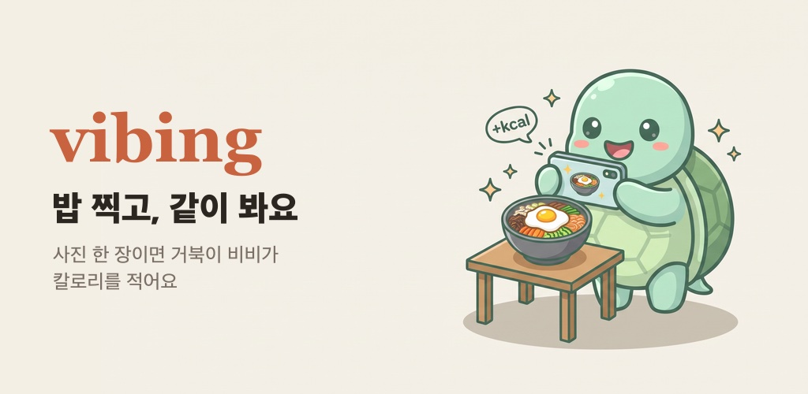
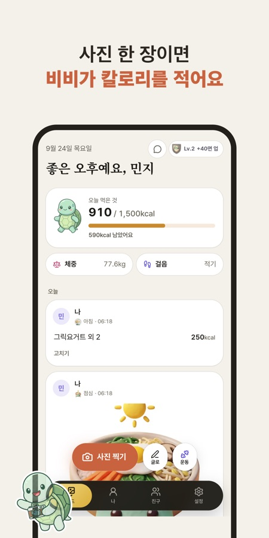
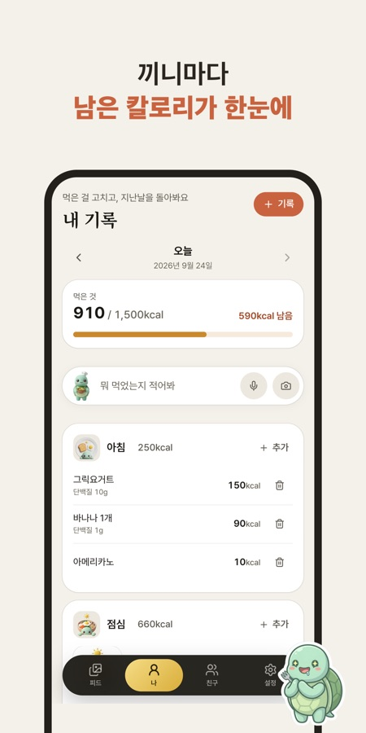
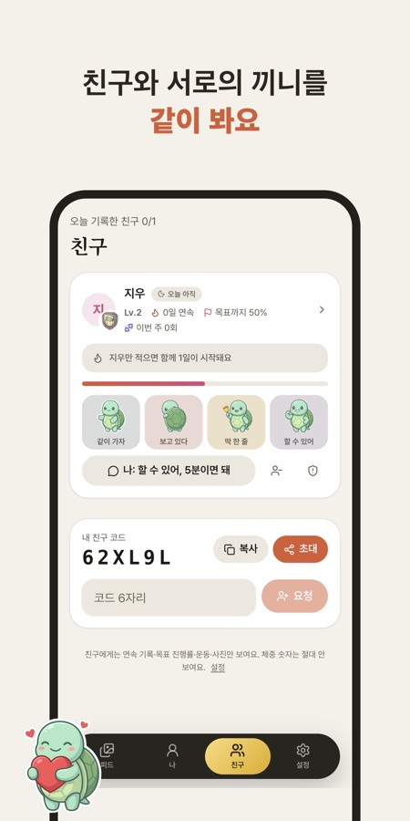

[한국어](README.md) · English

 

<picture>
  <source media="(prefers-color-scheme: dark)" srcset="./assets/dashboard-dark-2aac299b1d.svg">
  
</picture>

 

<picture>
  <source media="(prefers-color-scheme: dark)" srcset="https://raw.githubusercontent.com/wonjangcloud9/wonjangcloud9/output/snake-dark.svg">
  
</picture>

---

## What I'm building now

  

🐢 **vibing** — Snap a photo of what you eat and a turtle coach named **Bibi** logs the calories; you and your friends see each other's meals. Getting ready for the App Store and Google Play.

  
  
  

<b>Things I've built</b>

 

- 🦀 **[wonjangAgent](https://github.com/wonjangcloud9/wonjangAgent)** — A Korean-first autonomous AI agent. Single Rust binary
- 🌳 **[claude-tree](https://github.com/wonjangcloud9/claude-tree)** — Runs several Claude Code sessions in parallel, each in its own git worktree
- 🛡️ **[open-guardrail](https://github.com/wonjangcloud9/open-guardrail)** — Guardrails for LLM apps. Zero API calls, under 0.1ms
- 📏 **[harness-eval](https://github.com/wonjangcloud9/harness-eval)** — A CLI that puts a number on how much the harness changes results

---

## The path so far

<table>
<tr><td width="92" align="center"><b>2019</b> 2 repos</td><td>
First commit. I started by <b>cloning</b> — KakaoTalk, Netflix.
</td></tr>
<tr><td align="center"><b>2020–21</b> 385 commits</td><td>
The years I didn't use GitHub. I didn't know it mattered, so the code stayed on my laptop. <b>Zero commits in 2020.</b>
</td></tr>
<tr><td align="center"><b>2022</b> 91 repos 1,160 commits</td><td>
React, Next.js and Django — cloning Karrot Market, Airbnb and Twitter at eight repos a month.
</td></tr>
<tr><td align="center"><b>2023</b> 116 repos 1,894 commits</td><td>
<b>My busiest year.</b> Flutter, React Native and Jetpack Compose at once, plus my first real product attempts — a toilet finder, an education LMS, a complaint tracker, an AI companion.
</td></tr>
<tr><td align="center"><b>2024</b> 48 repos 1,314 commits</td><td>
LangChain and RAG put an LLM in a product for the first time.
</td></tr>
<tr><td align="center"><b>2025</b> 45 repos 852 commits</td><td>
Five health apps. Late in the year I stopped using other people's agents and <b>started writing my own</b>.
</td></tr>
<tr><td align="center"><b>2026</b> 36 repos 2,350 commits</td><td>
Shipped agent tools to npm and PyPI; now focused on vibing alone. <b>My highest-commit year, and it's only September.</b>
</td></tr>
</table>

---

## Subjects I kept coming back to

<b>How many repos each, and how far they got</b>

 

| Subject | Repos | How far it got |
|---|---|---|
| 🤖 **Agents & LLMs** | 26 | Following courses → writing my own → **four packages on npm and PyPI** |
| 🏃 **Weight & fitness** | 11 | The eleventh is vibing. The first ten taught me what to cut |
| 🎌 **Fandom & Japanese** | 7 | Consolidated into [custo](https://wonjangcloud9.github.io/custo/) |
| ⏱️ **Pomodoro** | 6 | One per new framework I picked up |
| 🎵 **TikTok clones** | 3 | Where I actually learned Flutter animations |
| 😴 **Sleep** | 3 | [Jammanbo](https://life-save-with-claude-code-multi-se.vercel.app) is the one that stuck |

I tend to stay on one subject for a long time. What I've changed is scope — nothing I build now goes past five screens.

---

## Tools

TypeScript · Next.js · React · Python · Rust · Flutter · Supabase · Claude Code

---

<b>189 of my 345 repos are private</b> — they hold keys or personal data. The numbers above include private commits.

