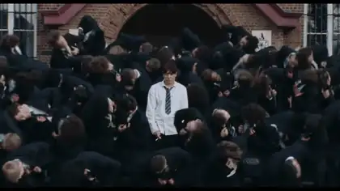

Building things in Seoul · [GS Neotek](https://www.gsneotek.co.kr)

[한국어](README.md) · English

 

<picture>
  <source media="(prefers-color-scheme: dark)" srcset="./assets/dashboard-dark-86c8758afd.svg">
  
</picture>

 

<picture>
  <source media="(prefers-color-scheme: dark)" srcset="https://raw.githubusercontent.com/wonjangcloud9/wonjangcloud9/output/snake-dark.svg">
  
</picture>

---

## 🔨 What I'm building now

<table>
<tr>
<td width="50%" valign="top">

### 🐢 vibing
A weight-loss app. Log what you ate, your weight and how much you moved, and today's **calorie deficit** shows up as one number. It backs out your real TDEE from 21 days of logs, and a turtle coach named Bibi nags you.

`Next.js` `Supabase` `PWA` · private · **shipped to daily**

</td>
<td width="50%" valign="top">

### 🦀 [wonjangAgent](https://github.com/wonjangcloud9/wonjangAgent)
A **Korean-first** autonomous AI agent. Single Rust binary — no runtime to install.

</td>
</tr>
<tr>
<td valign="top">

### 🌳 [claude-tree](https://github.com/wonjangcloud9/claude-tree)
A CLI that runs **multiple Claude Code sessions in parallel**, each isolated in its own git worktree. Docs in four languages.

</td>
<td valign="top">

### 🛡️ [open-guardrail](https://github.com/wonjangcloud9/open-guardrail)
A guardrail engine for LLM apps. Prompt injection, PII (26 regions), GDPR, EU AI Act — **zero API calls, under 0.1ms**.

 

</td>
</tr>
<tr>
<td colspan="2" valign="top">

### 📏 [harness-eval](https://github.com/wonjangcloud9/harness-eval)
A CLI that scores **harness engineering** quality and generates benchmarks from any repo. *Same model, better harness, very different results* — I built this to put a number on that.

</td>
</tr>
</table>

---

## 📖 The path so far

<table>
<tr><td width="92" align="center"><b>2019</b> 2 repos</td><td>
First commit. I started by <b>cloning</b> — KakaoTalk, Netflix.
</td></tr>
<tr><td align="center"><b>2020–21</b> 385 commits</td><td>
The years I didn't use GitHub. I didn't know it mattered, so the code stayed on my laptop. <b>Zero commits in 2020.</b>
</td></tr>
<tr><td align="center"><b>2022</b> 91 repos 1,160 commits</td><td>
React, Next.js and Django — cloning Karrot Market, Airbnb and Twitter at eight repos a month.
</td></tr>
<tr><td align="center"><b>2023</b> 116 repos 1,894 commits</td><td>
<b>My busiest year.</b> Flutter, React Native and Jetpack Compose at once, plus my first real product attempts — a toilet finder, an education LMS, a complaint tracker, an AI companion.
</td></tr>
<tr><td align="center"><b>2024</b> 48 repos 1,314 commits</td><td>
I narrowed down to one subject: <b>used cars</b> — an Encar crawler, a damage-detection FastAPI, mycarpageGPT. LangChain and RAG put an LLM in a product for the first time.
</td></tr>
<tr><td align="center"><b>2025</b> 45 repos 852 commits</td><td>
Four more used-car rebuilds and five health apps. Late in the year I stopped using other people's agents and <b>started writing my own</b>.
</td></tr>
<tr><td align="center"><b>2026</b> 36 repos 2,164 commits</td><td>
Shipped CLIs, evaluators and guardrails for AI coding agents to npm and PyPI. <b>My highest-commit year, and it's only September.</b>
</td></tr>
</table>

---

## 📌 Subjects I kept coming back to

<b>How many repos each, and how far they got</b>

 

| Subject | Repos | How far it got |
|---|---|---|
| 🤖 **Agents & LLMs** | 26 | Following courses → writing my own → **four packages on npm and PyPI** |
| 🚗 **Used cars** | 23 | Encar crawler → damage-detection API → GPT search → four MVPs. Since 2022 |
| 🏃 **Weight & fitness** | 11 | The eleventh is vibing. The first ten taught me what to cut |
| 🎌 **Fandom & Japanese** | 7 | Consolidated into [custo](https://wonjangcloud9.github.io/custo/) |
| ⏱️ **Pomodoro** | 6 | One per new framework I picked up |
| 🎵 **TikTok clones** | 3 | Where I actually learned Flutter animations |
| 😴 **Sleep** | 3 | [Jammanbo](https://life-save-with-claude-code-multi-se.vercel.app) is the one that stuck |

I tend to stay on one subject for a long time. What I've changed is scope — nothing I build now goes past five screens.

<b>🎮 Other things that actually run</b>

 

- 🎌 **[custo](https://wonjangcloud9.github.io/custo/)** — learn Japanese by being an idol fan
- 🎬 **[SubLineFix](https://github.com/wonjangcloud9/ko-video-subtitle-sync)** — merges captions with the script to fix subtitles **without any ASR**
- 🎮 **[mobily](https://github.com/wonjangcloud9/mobily)** — a login-free daily checklist for mobile RPG players
- 🛏️ **[Jammanbo](https://life-save-with-claude-code-multi-se.vercel.app)** — a sleep tracker PWA with XP and levels
- 🧱 **[flutter_riverpod_architecture_example](https://github.com/wonjangcloud9/flutter_riverpod_architecture_example)** — Flutter + Riverpod clean architecture
- 📷 **[react-native-compact-camera](https://github.com/wonjangcloud9/react-native-compact-camera)** — a minimal RN camera component

---

## 🎬 What I do for fun

When I'm not writing code, I make things like this with <b>Higgsfield</b> 🫡

## 🧰 What I reach for

---

<b>189 of my 345 repos are private</b> — they hold keys or personal data. The numbers above include private commits.

