서울에서 만듭니다 · [GS Neotek](https://www.gsneotek.co.kr)

한국어 · [English](README.en.md)

 

<picture>
  <source media="(prefers-color-scheme: dark)" srcset="./assets/dashboard-dark-7a989cf8c1.svg">
  
</picture>

매일 새벽 <a href="scripts/dashboard.mjs">직접 그리는 스크립트</a>가 다시 그립니다. 남의 서비스는 죽으니까요.

 

<picture>
  <source media="(prefers-color-scheme: dark)" srcset="https://raw.githubusercontent.com/wonjangcloud9/wonjangcloud9/output/snake-dark.svg">
  
</picture>

---

## 🔨 지금 만드는 것

<table>
<tr>
<td width="50%" valign="top">

### 🐢 vibing
먹은 것·체중·움직임을 적으면 **오늘의 칼로리 적자**가 숫자 하나로 보이는 감량 앱. 21일치 기록으로 실제 소모량을 역산하고, 거북이 코치 "비비"가 잔소리를 합니다.

`Next.js` `Supabase` `PWA` · 비공개 · **매일 고치는 중**

</td>
<td width="50%" valign="top">

### 🦀 [wonjangAgent](https://github.com/wonjangcloud9/wonjangAgent)
**한국어 우선** 자율 AI 에이전트. Rust 단일 바이너리라 런타임 없이 바로 돕니다.

</td>
</tr>
<tr>
<td valign="top">

### 🌳 [claude-tree](https://github.com/wonjangcloud9/claude-tree)
Claude Code 세션을 **git worktree로 격리해 여러 개 동시에** 굴리는 CLI. 문서 4개 언어.

</td>
<td valign="top">

### 🛡️ [open-guardrail](https://github.com/wonjangcloud9/open-guardrail)
LLM 앱용 가드레일 엔진. 프롬프트 인젝션·PII(26개 지역)·GDPR·EU AI Act를 **API 호출 0번, 0.1ms 안에**.

 

</td>
</tr>
<tr>
<td colspan="2" valign="top">

### 📏 [harness-eval](https://github.com/wonjangcloud9/harness-eval)
**"하네스 엔지니어링"** 품질에 점수를 매기고 아무 레포에서나 벤치마크를 뽑는 CLI. *같은 모델이어도 하네스가 좋으면 결과가 달라진다* — 그걸 숫자로 보려고 만들었습니다.

</td>
</tr>
</table>

---

## 📖 지나온 길

<table>
<tr><td width="92" align="center"><b>2019</b> 레포 3</td><td>
첫 커밋. 클론 코딩으로 시작했습니다 — 코코아톡, 넷플릭스.
</td></tr>
<tr><td align="center"><b>2020–21</b> 커밋 389</td><td>
깃허브를 쓰지 않던 시기. 중요한 줄 몰라서 코드가 로컬에만 쌓였습니다. 2020년 커밋 <b>0개</b>.
</td></tr>
<tr><td align="center"><b>2022</b> 레포 94 커밋 1,184</td><td>
React·Next.js·Django. 당근마켓, 에어비앤비, 트위터를 클론하며 한 달에 8개씩 레포를 열었습니다.
</td></tr>
<tr><td align="center"><b>2023</b> 레포 127 커밋 1,955</td><td>
<b>역대 최다 레포.</b> Flutter·React Native·Jetpack Compose를 동시에 다뤘고, 처음으로 제품을 시도했습니다 — 화장실 찾기, 교육 LMS, 민원 처리, AI 컴패니언.
</td></tr>
<tr><td align="center"><b>2024</b> 레포 48 커밋 1,355</td><td>
주제를 <b>중고차</b>로 좁혔습니다 — 엔카 크롤러, 손상 판별 FastAPI, mycarpageGPT. LangChain·RAG로 LLM을 처음 제품에 붙였습니다.
</td></tr>
<tr><td align="center"><b>2025</b> 레포 45 커밋 907</td><td>
중고차를 네 번 더 다시 만들고, 건강·운동 앱을 다섯 개. 후반엔 에이전트를 <b>직접 짜기 시작</b>했습니다.
</td></tr>
<tr><td align="center"><b>2026</b> 레포 35 커밋 2,100+</td><td>
AI 코딩 에이전트를 위한 CLI·평가·가드레일을 npm과 PyPI에 올렸습니다. <b>역대 최다 커밋, 아직 9월입니다.</b>
</td></tr>
</table>

---

## 📌 오래 매달렸던 주제

<b>주제별로 몇 개, 어디까지 갔나</b>

 

| 주제 | 레포 | 어디까지 갔나 |
|---|---|---|
| 🤖 **에이전트·LLM** | 26개 | 강의 따라하기 → 직접 짜기 → **npm·PyPI 배포 4개** |
| 🚗 **중고차** | 24개 | 엔카 크롤러 → 손상 판별 API → GPT 검색 → MVP 네 번. 2022년부터 |
| 🏃 **감량·운동** | 11개 | 열한 번째가 vibing. 앞의 열 개가 뭘 빼야 하는지 알려줬습니다 |
| 🎌 **덕질·일본어** | 7개 | [custo](https://wonjangcloud9.github.io/custo/)로 정리됐습니다 |
| ⏱️ **포모도로** | 6개 | 새 프레임워크를 배울 때마다 하나씩 |
| 🎵 **틱톡 클론** | 4개 | Flutter 애니메이션은 여기서 익혔습니다 |
| 😴 **수면** | 3개 | [잠만보](https://life-save-with-claude-code-multi-se.vercel.app)가 남았습니다 |

한 주제를 오래 붙잡는 편입니다. 대신 요즘은 범위를 좁게 잡습니다 — 만드는 것이 화면 다섯 개를 넘기지 않습니다.

<b>🎮 그 외 — 돌아가는 것들</b>

 

- 🎌 **[custo](https://wonjangcloud9.github.io/custo/)** — 아이돌 덕질하면서 일본어 배우는 사이트
- 🎬 **[자막 줄잘러](https://github.com/wonjangcloud9/ko-video-subtitle-sync)** — 자막 + 대본을 합쳐 **음성인식 없이** 자막을 고칩니다
- 🎮 **[mobily](https://github.com/wonjangcloud9/mobily)** — 로그인 없는 모바일 RPG 데일리 체크리스트
- 🛏️ **[잠만보](https://life-save-with-claude-code-multi-se.vercel.app)** — XP·레벨업 붙인 수면 트래커 PWA
- 🧱 **[flutter_riverpod_architecture_example](https://github.com/wonjangcloud9/flutter_riverpod_architecture_example)** — Flutter + Riverpod 클린 아키텍처
- 📷 **[react-native-compact-camera](https://github.com/wonjangcloud9/react-native-compact-camera)** — 가벼운 RN 카메라 컴포넌트

---

## 🎬 요즘 노는 것

코드 안 쓸 땐 <b>Higgsfield</b>로 이런 걸 만듭니다 🫡

## 🧰 쓰는 것

---

레포 361개 중 <b>189개는 비공개</b>입니다 — 키나 개인 데이터가 들어 있어서요. 위 숫자는 비공개 커밋을 포함합니다.

